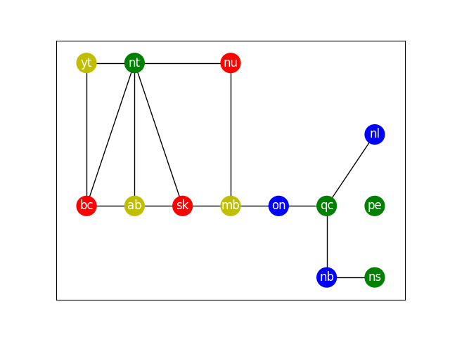

[](
  https://codespaces.new/dwave-examples/map-coloring?quickstart=1)
[](
  https://circleci.com/gh/dwave-examples/map-coloring)

# Map Coloring

A demo on using the QDeep SDK to solve the map coloring problem. Namely,
given a map, color the regions of the map such that no two regions sharing a
border would share the same color.


  
A graph representation of the provinces of Canada. Provinces connected by edges
share a border together. This is a sample output produced by this demo.

## Usage

Simply run the code with

```bash
python map_coloring.py
```


## License

Released under the Apache License 2.0. See [LICENSE](./LICENSE) file.

[1]: https://docs.ocean.dwavesys.com/projects/dwave-networkx/en/latest/reference/algorithms/generated/dwave_networkx.algorithms.coloring.min_vertex_color_qubo.html#dwave_networkx.algorithms.coloring.min_vertex_color_qubo
